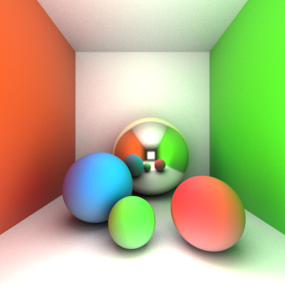

# Experimenting with Raytracing

The original idea was (and still is—when I have the time!) to create a photorealistic [RAL color](https://en.wikipedia.org/wiki/RAL_colour_standard) visualizer for various objects (specifically bikes, but others as well).

Starting this project, I had no prior experience with implementing raytracing, but merely a concept understanding of it. Turns out the math is not too complex (e.g. rearranging and solving quadratic polynomials for sphere surfaces). Everything was learned and implemented over the course of a (pretty intense) weekend.

## Screenshots

The raytracer is multi-threaded and makes use of all available CPU cores to minimize rendering time since the process is immensely computationally intensive. See screenshot below (if I remember correctly, the rendering time is about 40 hours on my dual-core [plus Hyper-Threading] Intel i7-4500U).

Below is a simple [Cornell box](https://en.wikipedia.org/wiki/Cornell_box) render containing a few spheres to show global illumination and color bleeding effects, taking about 90 minutes to render on the same hardware; much faster since there are no recursive reflections!

## Features

* Global illumination
* Color bleeding
* Recursive reflections
* Antialiasing (using a box filter)
* Depth-of-field (using a physically based [aperture](https://en.wikipedia.org/wiki/Aperture) model)
* Phong shading model
* Monte Carlo integration

## How does it work?

Raytracing is a matter of finding the point-of-intersection in 3-space (and, after that, calculating normals, light and shadow rays, reflections etc—not illustrated above!) closest to the eye. In the illustration above, we need to solve an equation for the two functions. Since we're interested in where, in space, the intersection between the line and sphere occurs, and since we start with a ray (each pixel rendered starts with a ray being cast in that direction from the eye/camera!), we want to solve the equation for the scalar t. This tells us how far along the ray we need to travel to end up at the intersection!

### Math

Let **o** be the origin (eye) and **d** the direction of the ray:

Let **c** and r be the center and radius of the sphere, respectively. For every point in space **q** where the equation holds true, **q** is a point on the sphere:

Or, equivalently with vector notation:

Solving the equation—finding if any point on the line is also a point on the sphere surface:

![Eq. 3](https://latex.codecogs.com/svg.latex?%5Cbegin%7Balign*%7D%20%26%28o_x&plus;d_xt-c_x%29%5E2%26%20%26&plus;%20%26%28o_y&plus;d_yt-c_y%29%5E2%26%20%26&plus;%20%26%5C%20%5C%20%28o_z&plus;d_zt-c_z%29%5E2%26%20%26%3D%20r%5E2%20%5C%5C%20%26%28o_x-c_x&plus;d_xt%29%5E2%26%20%26&plus;%20%26%28o_y-c_y&plus;d_yt%29%5E2%26%20%26&plus;%20%26%5C%20%5C%20%28o_z-c_z&plus;d_zt%29%5E2%20-r%5E2%26%20%26%3D%200%20%5Cend%7Balign*%7D%20%5C%5C%20%5C%5C%20%5Cbegin%7Balign*%7D%20%26%28o_x-c_x%29%5E2%20%26%20%26&plus;%20%26%202t%28o_x-c_x%29d_x%20%26%20%26&plus;%20%26%5C%20%5C%20t%5E2d_x%5E2%20%26&plus;%20%26%20%5C%5C%20%26%28o_y-c_y%29%5E2%20%26%20%26&plus;%20%26%202t%28o_y-c_y%29d_y%20%26%20%26&plus;%20%26%5C%20%5C%20t%5E2d_y%5E2%20%26&plus;%20%26%5C%5C%20%26%28o_z-c_z%29%5E2%20%26%20%26&plus;%20%26%202t%28o_z-c_z%29d_z%20%26%20%26&plus;%20%26%5C%20%5C%20t%5E2d_z%5E2%20%26-%20%26%20%26%20r%5E2%20%3D%20%5C%200%20%26%20%5Cend%7Balign*%7D%20%5C%5C%20%5C%5C%20%5Cbegin%7Balign*%7D%20%26t%5E2%20%28%26%26%5Cphantom%7B%28o_x-c_x%29%7Dd_x%5E2%26%20%26&plus;%20%26%26%5Cphantom%7B%28o_y-c_y%29%7Dd_y%5E2%26%20%26&plus;%20%26%26%5Cphantom%7B%28o_z-c_z%29%7Dd_z%5E2%26%29%20%26%26&plus;%20%5C%5C%20%262t%20%28%26%26%28o_x-c_x%29d_x%26%20%26&plus;%20%26%26%28o_y-c_y%29d_y%26%20%26&plus;%20%26%26%28o_z-c_z%29d_z%26%29%20%26%26&plus;%20%5C%5C%20%26%5C%20%26%26%28o_x-c_x%29%5E2%26%20%26&plus;%20%26%26%28o_y-c_y%29%5E2%26%20%26&plus;%20%26%26%28o_z-c_z%29%5E2%26%20%26%26-%20%26%26r%5E2%20%3D%200%20%5Cend%7Balign*%7D%20%5C%5C%20%5C%5C%20%5Cbegin%7Balign*%7D%20a%26%3D%28d_x%5E2&plus;d_y%5E2&plus;d_z%5E2%29%20%5C%5C%20b%26%3D2%28%28o_x-c_x%29d_x&plus;%28o_y-c_y%29d_y&plus;%28o_z-c_z%29d_z%29%20%5C%5C%20c%26%3D%28o_x-c_x%29%5E2&plus;%28o_y-c_y%29%5E2&plus;%28o_z-c_z%29%5E2-r%5E2%20%5Cend%7Balign*%7D "Eq. 3")

Simplified final form with vector notation:

